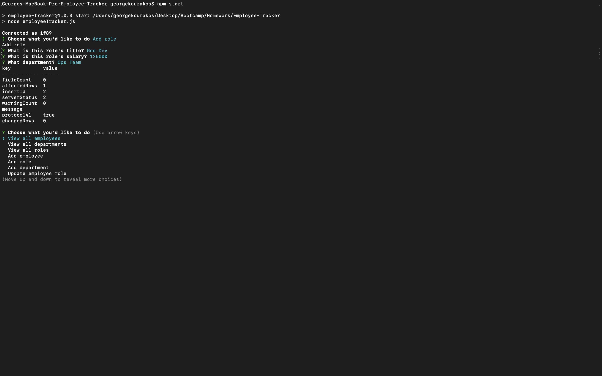
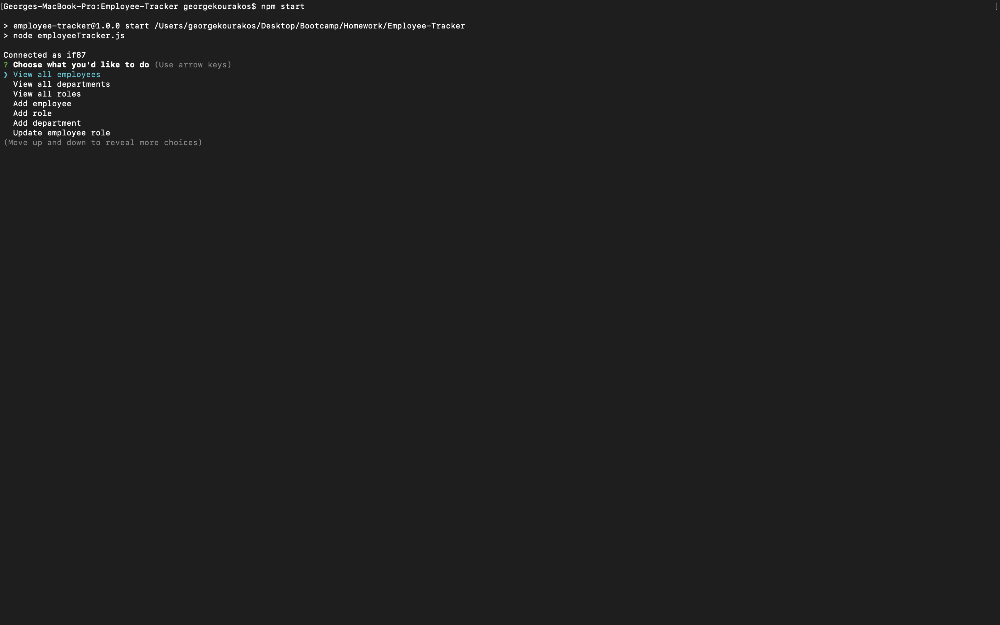

# Employee Tracker
## Description

This application allows a company to access a database that contains information regarding employees, their roles, salaries, and the departments they work in.  The user can edit all of this information through the terminal.
 ## Table of Contents

 1. [Installation](#installation)
 2. [Usage](#usage)
 3. [License](#license)
 4. [Contributing](#contributing)
 5. [Tests](#tests)
 6. [Questions](#questions)

## Installation

The user uses npm i to install this application and then npm start to run it.

## Usage

Simply follow the command line instructions and use the arrow keys and [ENTER/RETURN] to submit answers and navigate the terminal.

## License

## Contributing

No contributions and this time please.

## Tests

There is no testing needed.

## Visuals

## Questions

You made it this far! If you have questions contact me on [GitHub] (http://github.com/gkourako).  If not you can email me at georgekourakos4@gmail.com
